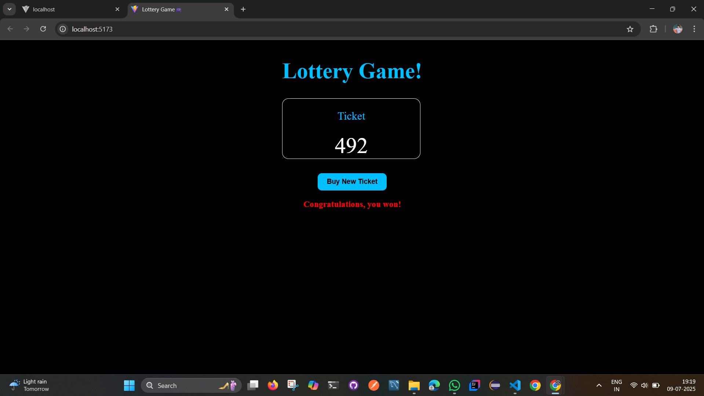

# 🎰 Lottery Game

A simple and fun React app where you buy a lottery ticket, and if the sum of the digits is equal to the winning number, you win!

---

## 📋 How It Works

1. Each lottery ticket has **3 random digits**.
2. If the **sum of all digits equals 15**, you win! 🏆
3. Click **"Buy New Ticket"** to try again.

---

## 🛠 Tech Stack

- React.js
- JavaScript
- CSS
- HTML

---

## 📁 Project Structure

src/
├── App.js
├── App.css
├── main.jsx
├── GenerateTicket.js
├── Lottery.js
├── Ticket.js
├── TicketNum.js

---

## ⚙️ Installation & Setup

To run this project locally:

```bash
# 1. Clone the repository
git clone https://github.com/ershamshad12/Lottery-Game.git

# 2. Navigate to the project directory
cd Lottery-Game

# 3. Install dependencies
npm install

# 4. Start the development server
npm start
```

## 🧠 Props Used

### '<Lottery />' component

| Prop         | Type   | Description                    |
| ------------ | ------ | ------------------------------ |
| `n`          | Number | Number of digits in the ticket |
| `winningSum` | Number | Target sum to win the lottery  |

# 🖼️ UI Example

## 🖼️ UI Example

### Before Winning


### After Winning



If your ticket shows:

4 6 5
Then the sum is: 4 + 6 + 5 = 15 ✅
You win! 🎉

# 🎨 Styling Overview

Dark background centered layout.

Stylish lottery card with white border and large digits.

Blue “Buy New Ticket” button with hover effect.

Red winning message for a clean visual pop.

# 📃 License

This project is open-source and available under the MIT License.

# 🙌 Author

Made with 💙 by [Md Shamshad Ansari](https://github.com/ershamshad12)

---
